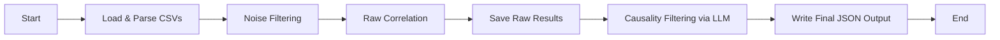

# Correlating Change Events to Incident Events

This repository contains a Python-based solution to identify and count unique causal relationships between system change events and incident events within a configurable time window (default: 60 minutes).

## Table of Contents

- [Assumptions](#assumptions)
- [Features](#features)
- [Installation](#installation)
- [Usage](#usage)
- [Architecture & Flow](#architecture--flow)
- [Key Modules](#key-modules)
- [Next Steps & Improvements](#next-steps--improvements)

## Assumptions

- **Match Scope**: Only correlate events sharing the same `account_id` and `service_id`.
- **Time Window**: Inclusive 60 minutes prior to each incident timestamp (configurable).
- **Deduplication**: Change titles deduped by `(account_id, service_id, title)`—only the first occurrence per incident window counts.
- **Noise Filtering**: Titles classified as `NOISE` by the LLM are removed before correlation.
- **Output**: JSON mapping of `"incident_title ||| change_title" → count`; incidents with zero matches are omitted.

## Features

- **CSV Ingestion**: Reads and normalizes `change_events.csv` and `incident_events.csv`.
- **LLM-Based Noise Removal**: Filters out unimportant change and incident titles using OpenAI API.
- **Efficient Window Correlation**: Uses a deque to maintain a sliding window of relevant change events.
- **Causality Confirmation**: Verifies likely causality of each pair using an LLM.
- **JSON Output**: Writes final causal relationships to a JSON file.

## Installation

1. Clone the repository:
   ```bash
   git clone https://github.com/abhimazu/pagerduty-submission.git
   cd pagerduty-submission
   ```
2. Create and activate a virtual environment:
   ```bash
   python -m venv venv
   source venv/bin/activate    # Linux/macOS
   venv\Scripts\activate     # Windows
   ```
3. Install dependencies:
   ```bash
   pip install -r requirements.txt
   ```
4. Set your OpenAI API key:
   ```bash
   export OPENAI_API_KEY="your_api_key_here"    # Linux/macOS
   set OPENAI_API_KEY="your_api_key_here"       # Windows
   ```

## Usage

```bash
python correlate.py \
  --changes csv/change_events.csv \
  --incidents csv/incident_events.csv \
  --output final_output.json \
  --window-minutes 60 \
  --model gpt-4.1-nano
```

- `--window-minutes`: Time window in minutes (default: 60).
- `--model`: OpenAI model to use for LLM-based filtering (default: `gpt-4o-mini`).

## Architecture & Flow

The solution is structured into five logical stages, each designed for clarity, efficiency, and scalability:

1. **Data Ingestion & Preparation**  
   Both CSV files are loaded into pandas DataFrames, timestamps are parsed, and only the required columns (`account_id`, `service_id`, `title`, `timestamp`) are selected. All timestamps are converted to datetime objects to ensure accurate time‑based computations.

2. **LLM‑Driven Noise Filtering**  
   Each unique change and incident title is classified as `MEANINGFUL` or `NOISE` using an LLM via the OpenAI API. Classification results are cached locally to minimize redundant API calls, and noise entries are filtered out before correlation.

3. **Sliding‑Window Correlation**  
   Events are grouped by the combined key `(account_id, service_id)`, ensuring comparisons remain within the same service context. Within each group, change and incident events are sorted by timestamp. A deque is used to maintain change events occurring within the 60‑minute window preceding each incident; expired entries are evicted automatically, and unique change titles are counted once per incident.

4. **Causality Confirmation**  
   The LLM is queried again to determine whether each `(incident title, change title)` pair represents a true causal relationship. Pairs labeled `CAUSAL` are retained, while others are discarded.

5. **Result Serialization**  
   Final causal pairs and their counts are serialized to JSON in the `"incident_title ||| change_title": count` format. Entries with zero counts are omitted, producing a concise output.



This architecture leverages:

- Partitioning by service context for parallelism
- Caching of LLM responses for performance
- Deque‑based windowing for O(N) per‑group complexity
- Modularity for easy testing and extension

## Key Functions

- **`load_and_prepare()`**: Ingests CSVs, parses timestamps, and selects necessary fields.
- **`filter_noise()`**: Calls LLM to understand each unique title within incidents, change records. It classifies and removes `NOISE` titles, caching results to avoid repeat LLM calls.
- **`raw_correlate()`**: Implements the sliding window algorithm with a deque to correlate events within the given time period.
- **`filter_causality()`**: Uses LLM classification to confirm true causal pairs from the above correlation.
- **`write_results()`**: Serializes the final counts to JSON.
